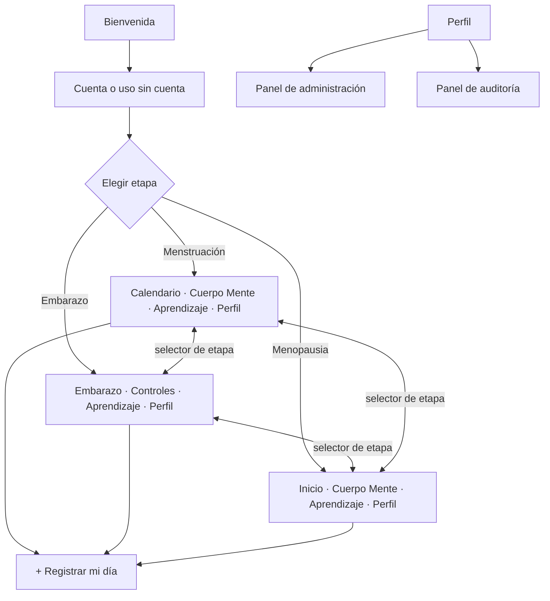
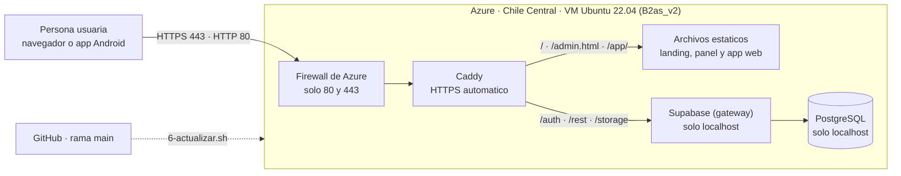

# Metztli — Salud Femenina Integral Intercultural (Offline-First)

<div align="center">


</div>

---

## 🌙 Acerca de Metztli

**Metztli** es una aplicación de salud sexual, reproductiva y comunitaria para mujeres y personas gestantes de la **Costa Caribe de Nicaragua** (RACCN y RACCS: Bluefields, Bilwi, Waspam, Corn Island y comunidades rurales). Responde a tres problemas: conectividad limitada, barreras de idioma y desinformación médica.

1. **Offline-First**: funciona completa sin internet con una base **SQLite** en el teléfono; sincroniza con **Supabase** cuando hay red.
2. **Trilingüe**: **Español**, **Miskitu** y **Creole (Kriol)**, con cambio inmediato y audios comunitarios en Miskitu.
3. **Privacidad por diseño**: los datos íntimos viven en el teléfono. El respaldo en la nube es **opcional** (apagado por defecto) y ni siquiera los administradores pueden leer datos de salud de otras personas.

---

## 👩🏾 ¿A quién va dirigida la app?

| Público | Cómo la usa |
| :--- | :--- |
| **Mujeres y personas gestantes** de la Costa Caribe de Nicaragua (RACCN y RACCS), en zonas urbanas y rurales | Registran su ciclo, embarazo o menopausia, aprenden y consultan sin necesitar internet |
| **Comunidades miskitu y creole**, y personas con poca alfabetización | Usan la app en su idioma y con audio (lectura por voz y audios comunitarios en Miskitu) |
| **Parejas y familiares** (modo acompañante) | Reciben consejos para apoyar a la persona, con su permiso y un código de vinculación |
| **Promotoras de salud y parteras** | La usan como apoyo educativo y para orientar sobre señales de alarma y auxilio por SMS |
| **Personal de la plataforma** (Administradores y Auditores) | Moderan contenido y supervisan, **sin acceso a datos de salud** de nadie |

**Contexto**: zonas con conectividad limitada, barreras de idioma y desinformación médica, donde el acceso a centros de salud suele ser lejano.

> Metztli es una herramienta educativa y de acompañamiento. **No sustituye la atención médica**: ante señales de alarma, la app indica acudir al centro de salud.

---

## 🎯 ¿A quién va dirigido este README?

Este documento técnico tiene tres públicos. Cada uno puede ir directo a su parte:

| Si eres… | Qué necesitas | Dónde ir |
| :--- | :--- | :--- |
| 🧑‍⚖️ **Jurado / evaluadora del reto** | Ver qué se entrega y cómo cumple cada entregable | [Índice de entregables](docs/README.md) · [Funcionalidades del Reto](docs/FUNCIONALIDADES_DEL_RETO.md) · [Despliegue y Presentación](docs/DESPLIEGUE_Y_PRESENTACION.md) |
| 👩‍💻 **Equipo de desarrollo / quien mantiene el código** | Arquitectura, base de datos, ejecución local, roles, pruebas y CI/CD | Este README · [Ejecución](docs/EJECUCION_DE_LA_SOLUCION.md) · [Base de datos](docs/DIAGRAMA_BASE_DATOS.md) · [Seguridad](docs/SEGURIDAD_Y_BUENAS_PRACTICAS.md) · [Control de versiones](docs/CONTROL_DE_VERSIONES.md) |
| 🩺 **Promotoras de salud, parteras y usuarias** | Usar la app paso a paso, sin conocimientos técnicos | [Guía de Usuario Rápida](docs/GUIA_DE_USUARIO_RAPIDA.md) |

> **Conocimientos previos para la parte técnica**: JavaScript/TypeScript, React Native con Expo, nociones de SQL y de Git. Para solo probar la app basta con Node.js y el APK o la web demo.

---

## 🧭 Etapas y módulos

La app se organiza por **etapa de vida**. Cada etapa tiene sus propias pantallas y se puede cambiar en cualquier momento desde el selector de etapa (los datos de las demás se conservan).

| Etapa | Pestañas | Qué ofrece |
| :--- | :--- | :--- |
| 🩸 **Menstruación** | Calendario · Cuerpo Mente · **+** · Aprendizaje · Perfil | Anillo del ciclo con fases, color del flujo, moco cervical, registro de período, "¿Cómo habitas tu día?", modo retiro |
| 🤰 **Embarazo** | Embarazo · Controles · **+** · Aprendizaje · Perfil | Semana y progreso desde la FUM o fecha de parto, controles prenatales (con alerta de presión alta), contador de pataditas, señales de alarma, triage y auxilio por SMS |
| 🌿 **Menopausia** | Inicio · Cuerpo Mente · **+** · Aprendizaje · Perfil | Registro de síntomas, consejos y contenido de la etapa |

Módulos transversales: **Desmitificador** (mitos y verdades, con audio en Miskitu), **Aprendizaje** (botiquín de saberes con lectura por voz), **Tribu** (foro anónimo), **Directorio de emergencias**, **Modo acompañante** y **Perfil e Historial**.



---

## 👥 Roles y seguridad

Metztli tiene tres perfiles de acceso. Cada uno solo ve y hace lo que necesita:

| Perfil | Para qué sirve |
| :--- | :--- |
| **Usuarios** | Es el perfil de todas las personas que usan la app: registrar su etapa, aprender, participar en el foro y, si quieren, respaldar sus propios datos. |
| **Administradores** | Cuida el contenido de la plataforma: gestiona las cuentas y sus perfiles, modera el foro, mantiene los mitos y el directorio, atiende las solicitudes de demo y publica las versiones de la app. |
| **Auditores** | Revisa que todo funcione con transparencia: consulta estadísticas generales y el historial de acciones, solo para lectura. |

**Privacidad ante todo**: los datos de salud de cada persona son solo suyos. Ni la administración ni la auditoría pueden verlos, y las acciones del personal quedan registradas en un historial que no se puede modificar. El detalle técnico y las pruebas están en [Seguridad y Buenas Prácticas](docs/SEGURIDAD_Y_BUENAS_PRACTICAS.md).

---

## 🏗️ Arquitectura


---

## 🛠️ Stack tecnológico

| Capa | Tecnología | Propósito |
| :--- | :--- | :--- |
| App | React Native 0.74 + Expo SDK 51, TypeScript estricto | Android y web con un solo código |
| Navegación | React Navigation (tabs por etapa + stack) | Pantallas independientes por etapa |
| Estilos | Tokens propios (`src/theme`) + Inter (`@expo-google-fonts`) | Paleta Avena / Carmín / Bosque del prototipo de Figma |
| Datos locales | `expo-sqlite` | Fuente principal, funciona sin conexión |
| Nube | Supabase (PostgreSQL 15, Auth, RLS) | Foro, mitos, respaldo opcional, roles y auditoría |
| i18n | `i18next` + espacio `ui` (el texto en español es la clave) | Español, Miskitu y Creole |
| Audio | `expo-speech`, `expo-av` | Lectura por voz y audios en Miskitu |
| Seguridad local | `expo-secure-store` | Sesión y preferencias |
| CI/CD | GitHub Actions | APK y web demo automáticos |

---

## 📂 Estructura del repositorio

```
Metztli/
├── .github/workflows/
│   ├── build-apk.yml            # APK en cada push a main (+ Release en etiquetas v*)
│   ├── deploy-web.yml           # Web demo y landing en GitHub Pages
│   └── package-release.yml      # Paquetes web y Azure adjuntos al Release
├── backend/
│   ├── supabase/
│   │   ├── migrations/          # 000–007: tablas, RLS, roles, auditoría, solicitudes de demo y versiones
│   │   └── setup_completo.sql   # Todo junto (lo aplica el servidor de Azure)
│   └── tests/rls.test.mjs       # Pruebas de seguridad sobre PostgreSQL real
├── infra/azure/                 # Scripts 1–6: crear la VM, instalar, evidencias, administrador, APK y actualizar
├── landing/                     # Landing page, formulario de demo y panel del equipo (/admin.html)
├── docs/                        # Entregables (ver tabla más abajo)
├── frontend/
│   ├── App.tsx                  # Proveedores (etapa, rol), navegación y arranque
│   ├── app.json · app.config.js · eas.json · metro.config.js
│   ├── assets/                  # Logo, icono adaptable y audios en Miskitu
│   └── src/
│       ├── navigation/          # Pestañas por etapa y barra inferior
│       ├── context/             # StageContext (etapa) y RoleContext (rol)
│       ├── screens/             # Pantallas (CycleHome, PregnancyHome, Prenatal, AdminPanel…)
│       ├── components/          # UI kit, CycleRing, StageSwitcher, Logo vectorial…
│       ├── db/                  # SQLite: schema.ts, pregnancySchema.ts, sync, respaldo en la nube
│       ├── lib/                 # dailyLog, roles, prefs, audio, supabase
│       ├── i18n/                # es / miskitu / creole + textos de interfaz
│       ├── data/                # Artículos y audios del Desmitificador
│       └── theme/               # Colores, tipografía, radios y sombras
├── scripts/check-supabase.mjs   # Verifica conexión, tablas, RLS y roles
├── scripts/verify-deploy.mjs    # Comprueba que Azure corre el mismo commit que main
├── scripts/serve-landing.mjs    # Servidor local para probar la landing
└── README.md
```

---

## 🚀 Inicio rápido

### 1. Instalación
```bash
git clone https://github.com/cuoconatwatah-create/Metztli.git
cd Metztli/frontend
npm install
cp .env.example .env     # en Windows: copy .env.example .env
```
Edita `frontend/.env` con la URL y la *publishable key* de tu proyecto de Supabase (nunca la `service_role`).

### 2. Crear el backend (una sola vez)
En Supabase → **SQL Editor**, pega y ejecuta `backend/supabase/setup_completo.sql`. Luego verifica:
```bash
node scripts/check-supabase.mjs     # debe terminar en "Todo en orden"
```
Para tener un administrador y un auditor, sigue [`backend/supabase/seed_roles_demo.sql`](backend/supabase/seed_roles_demo.sql).

### 3. Ejecutar
```bash
cd frontend
npm run web              # demo web en http://localhost:8081
npx expo start -c        # móvil con Expo Go (escanea el QR)
```

### 4. APK Android
- **Automático:** el workflow *Build Android APK* genera el APK en cada push a `main` (pestaña **Actions → Artifacts**) y, al crear una etiqueta `v*`, lo publica en **Releases**.
- **Local:** `npx expo prebuild --platform android --clean && cd android && ./gradlew assembleRelease`

Despliegue para presentar: [Despliegue y Presentación](docs/DESPLIEGUE_Y_PRESENTACION.md). Servidor propio en Azure, **landing page, formulario de demo y panel del equipo** (con subida del APK): [Despliegue en Azure](docs/AZURE_DESPLIEGUE.md#8-landing-page-solicitudes-de-demo-y-panel-del-equipo-segundo-sprint). El código está en [`landing/`](landing/).

---

## ☁️ Despliegue en Azure (cómo quedó)

Metztli corre en **un servidor propio en Azure**: una máquina virtual con **Supabase completo** (base de datos PostgreSQL, cuentas y almacenamiento de archivos), la **landing page**, el **formulario de demo**, el **panel del equipo** y la **app web**. La app Android guarda y lee sus datos en ese servidor.



### Qué hay y dónde

| Pieza | Dirección |
| :--- | :--- |
| **Landing** (presenta la app, descarga del APK, formulario de demo) | https://57-156-57-186.sslip.io/ · también por la IP: http://57.156.57.186/ |
| **Panel del equipo** (solicitudes de demo y subida de versiones; solo rol Administrador) | https://57-156-57-186.sslip.io/admin.html |
| **App web** (la misma app, en el navegador) | https://57-156-57-186.sslip.io/app/ |
| **Versión publicada** (versión y commit exactos) | https://57-156-57-186.sslip.io/version.json |
| **API y base de datos** (la usa la app) | https://57-156-57-186.sslip.io/auth/v1 · /rest/v1 · /storage/v1 |

**Máquina virtual:** `metztli-vm` · grupo de recursos `metztli-rg` · región **Chile Central** · tamaño **Standard_B2as_v2** (2 CPU, 8 GB) · Ubuntu 22.04 · IP pública estática **57.156.57.186**. El nombre `57-156-57-186.sslip.io` apunta a esa IP y permite el certificado HTTPS gratuito de Let's Encrypt (Caddy lo renueva solo).

### Seguridad básica: puertos

| Puerto | Estado | Para qué |
| :--- | :--- | :--- |
| **80** (HTTP) | Abierto | Entrada por la IP directa y redirección a HTTPS |
| **443** (HTTPS) | Abierto | Landing, panel, app web y API |
| 22 (SSH) | **Cerrado** | Solo se abre para mantenimiento (`az vm open-port -g metztli-rg -n metztli-vm --port 22 --priority 900`) y se vuelve a cerrar |
| 5432 / 6543 (base de datos) | **Cerrados** | La base de datos no es accesible desde internet |
| 8000 / 8443 (gateway de Supabase) | **Cerrados** | Solo responde a Caddy, dentro de la misma máquina |

Doble protección: el firewall de Azure solo deja pasar 80 y 443, y además Docker publica los puertos internos únicamente en `127.0.0.1`. Las claves del servidor se generaron al instalar y no están en el repositorio. Los datos de salud de cada persona están protegidos por reglas en la propia base de datos (RLS), y las pruebas están en `backend/tests/rls.test.mjs`.

### Cómo se desplegó (reproducible)

Todo está en [`infra/azure/`](infra/azure/); el paso a paso con la evidencia de cada entregable está en [docs/AZURE_DESPLIEGUE.md](docs/AZURE_DESPLIEGUE.md).

```bash
# 1) En Azure Cloud Shell: crea la VM (prueba regiones y tamaños; Azure para estudiantes recomienda Chile Central y B2as_v2)
bash 1-crear-vm.sh
# 2) Dentro de la VM: instala Docker, Supabase, las tablas (backend/supabase/setup_completo.sql) y publica la web
curl -fsSL https://raw.githubusercontent.com/cuoconatwatah-create/Metztli/main/infra/azure/2-instalar-servidor.sh | bash
# 4) Crea la cuenta de Administrador para el panel (pide la contraseña sin mostrarla)
bash /opt/metztli-src/infra/azure/4-crear-admin.sh tu@correo.com
# 5) Opcional: publica un APK en el servidor sin entrar al panel
bash /opt/metztli-src/infra/azure/5-publicar-apk.sh 2.0.10 <url-del-apk>
```

La app Android se compila en GitHub al crear una etiqueta `v*`, usando las variables del repositorio `EXPO_PUBLIC_SUPABASE_URL` y `EXPO_PUBLIC_SUPABASE_ANON_KEY`, que apuntan a este servidor. El APK sale en [Releases](https://github.com/cuoconatwatah-create/Metztli/releases/latest) y también se puede descargar desde la landing.

### El código en Azure es el de la rama principal

`6-actualizar.sh` trae `main` de GitHub, publica la web y escribe `/version.json` con la versión y el **commit exacto** publicados. Para comprobarlo:

```bash
node scripts/verify-deploy.mjs          # compara el commit de Azure con el último de main en GitHub
```

Debe terminar en **"IDÉNTICOS"**. Para actualizar Azure después de cambiar `main`: `bash /opt/metztli-src/infra/azure/6-actualizar.sh` (dentro de la VM, o con `az vm run-command invoke` sin abrir el SSH).

### Funciona sin ayuda del equipo técnico

Una persona puede hacer todo el recorrido sola: abrir la landing, descargar e instalar el APK, **crear su cuenta con correo y contraseña** (sin correo de confirmación), elegir su etapa, registrar su día, activar el respaldo y ver ese dato guardado en la base de Azure. Quien quiera conocer Metztli completa el formulario de demo y el equipo lo ve en el panel. Al reiniciar la VM, todos los servicios vuelven a levantarse solos (reinicio automático de Docker).

### Límites y cuidados

- Es **un solo servidor sin copias automáticas**; es una demostración, no un servicio de producción.
- Corre con el **crédito de Azure para estudiantes**: si se acaba o se apaga la VM, el sitio deja de responder. La app Android sigue funcionando sin conexión con lo guardado en el teléfono.
- La confirmación de correo está **apagada** para que el registro sea inmediato; cualquiera puede crear una cuenta. Para producción, conviene configurar un servidor de correo y activarla.
- El nombre `sslip.io` es un servicio gratuito de terceros; la IP directa funciona sin él.

---

## 📚 Documentación de entregables

| # | Entregable | Documento |
| :--: | :--- | :--- |
| 1 | README técnico | Este archivo + [Ejecución de la Solución](docs/EJECUCION_DE_LA_SOLUCION.md) |
| 2 | Diagramación de BD (hasta 2FN) | [Diagrama de Base de Datos](docs/DIAGRAMA_BASE_DATOS.md) |
| 3 | Interfaces y desarrollo | [Interfaz y Desarrollo](docs/INTERFAZ_Y_DESARROLLO.md) |
| 4 | Control de versiones | [Control de Versiones](docs/CONTROL_DE_VERSIONES.md) |
| 5 | Seguridad y roles | [Seguridad y Buenas Prácticas](docs/SEGURIDAD_Y_BUENAS_PRACTICAS.md) |
| 6 | Ejecución y demostración | [Despliegue y Presentación](docs/DESPLIEGUE_Y_PRESENTACION.md) (incluye el guion del video) |

Complementarios: [Funcionalidades del Reto](docs/FUNCIONALIDADES_DEL_RETO.md) · [Guía de Usuario Rápida](docs/GUIA_DE_USUARIO_RAPIDA.md)

---

## 👥 Equipo y créditos
- **Equipo CUOCONATWATAH** — Costa Caribe de Nicaragua
- Licencia: código de impacto social y comunitario.
