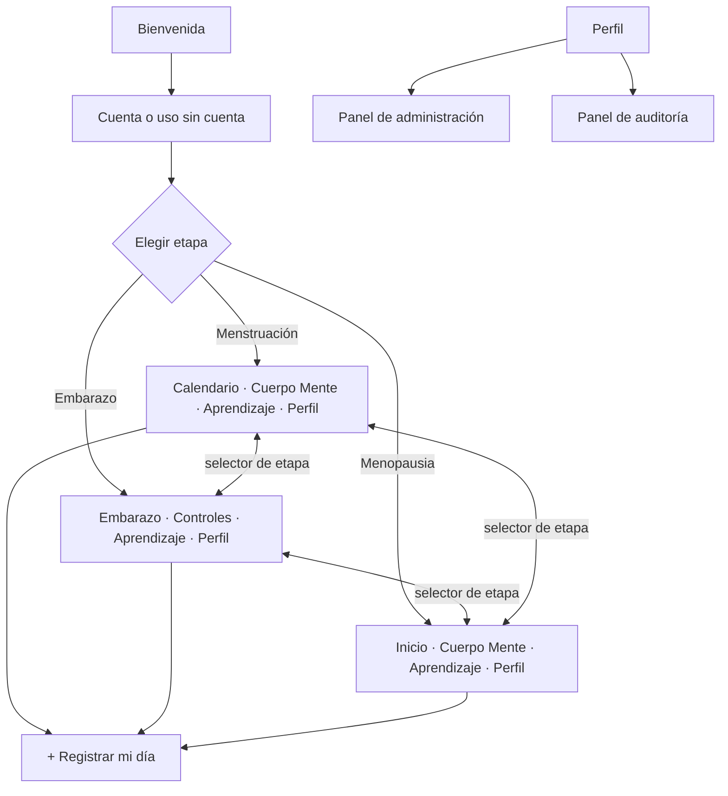
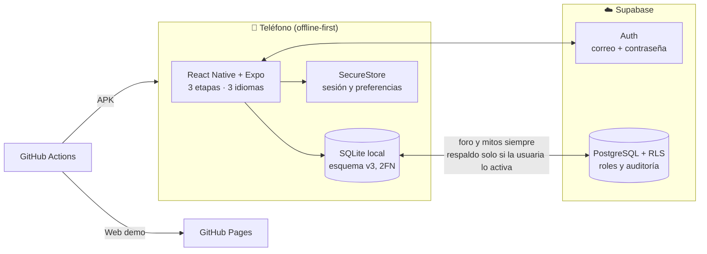

# Metztli — Salud Femenina Integral Intercultural (Offline-First)

<div align="center">


</div>

---

## 🌙 Acerca de Metztli

**Metztli** es una aplicación de salud sexual, reproductiva y comunitaria para mujeres y personas gestantes de la **Costa Caribe de Nicaragua** (RACCN y RACCS: Bluefields, Bilwi, Waspam, Corn Island y comunidades rurales). Responde a tres problemas: conectividad limitada, barreras de idioma y desinformación médica.

1. **Offline-First**: funciona completa sin internet con una base **SQLite** en el teléfono; sincroniza con **Supabase** cuando hay red.
2. **Trilingüe**: **Español**, **Miskitu** y **Creole (Kriol)**, con cambio inmediato y audios comunitarios en Miskitu.
3. **Privacidad por diseño**: los datos íntimos viven en el teléfono. El respaldo en la nube es **opcional** (apagado por defecto) y ni siquiera las administradoras pueden leer datos de salud de otras personas.

---

## 👩🏾 ¿A quién va dirigida la app?

| Público | Cómo la usa |
| :--- | :--- |
| **Mujeres y personas gestantes** de la Costa Caribe de Nicaragua (RACCN y RACCS), en zonas urbanas y rurales | Registran su ciclo, embarazo o menopausia, aprenden y consultan sin necesitar internet |
| **Comunidades miskitu y creole**, y personas con poca alfabetización | Usan la app en su idioma y con audio (lectura por voz y audios comunitarios en Miskitu) |
| **Parejas y familiares** (modo acompañante) | Reciben consejos para apoyar a la persona, con su permiso y un código de vinculación |
| **Promotoras de salud y parteras** | La usan como apoyo educativo y para orientar sobre señales de alarma y auxilio por SMS |
| **Personal de la plataforma** (Administradora y Auditora) | Moderan contenido y supervisan, **sin acceso a datos de salud** de nadie |

**Contexto**: zonas con conectividad limitada, barreras de idioma y desinformación médica, donde el acceso a centros de salud suele ser lejano.

> Metztli es una herramienta educativa y de acompañamiento. **No sustituye la atención médica**: ante señales de alarma, la app indica acudir al centro de salud.

---

## 🎯 ¿A quién va dirigido este README?

Este documento técnico tiene tres públicos. Cada uno puede ir directo a su parte:

| Si eres… | Qué necesitas | Dónde ir |
| :--- | :--- | :--- |
| 🧑‍⚖️ **Jurado / evaluadora del reto** | Ver qué se entrega y cómo cumple cada entregable | [Índice de entregables](docs/README.md) · [Funcionalidades del Reto](docs/FUNCIONALIDADES_DEL_RETO.md) · [Despliegue y Presentación](docs/DESPLIEGUE_Y_PRESENTACION.md) |
| 👩‍💻 **Equipo de desarrollo / quien mantiene el código** | Arquitectura, base de datos, ejecución local, roles, pruebas y CI/CD | Este README · [Ejecución](docs/EJECUCION_DE_LA_SOLUCION.md) · [Base de datos](docs/DIAGRAMA_BASE_DATOS.md) · [Seguridad](docs/SEGURIDAD_Y_BUENAS_PRACTICAS.md) · [Control de versiones](docs/CONTROL_DE_VERSIONES.md) |
| 🩺 **Promotoras de salud, parteras y usuarias** | Usar la app paso a paso, sin conocimientos técnicos | [Guía de Usuario Rápida](docs/GUIA_DE_USUARIO_RAPIDA.md) |

> **Conocimientos previos para la parte técnica**: JavaScript/TypeScript, React Native con Expo, nociones de SQL y de Git. Para solo probar la app basta con Node.js y el APK o la web demo.

---

## 🧭 Etapas y módulos

La app se organiza por **etapa de vida**. Cada etapa tiene sus propias pantallas y se puede cambiar en cualquier momento desde el selector de etapa (los datos de las demás se conservan).

| Etapa | Pestañas | Qué ofrece |
| :--- | :--- | :--- |
| 🩸 **Menstruación** | Calendario · Cuerpo Mente · **+** · Aprendizaje · Perfil | Anillo del ciclo con fases, color del flujo, moco cervical, registro de período, "¿Cómo habitas tu día?", modo retiro |
| 🤰 **Embarazo** | Embarazo · Controles · **+** · Aprendizaje · Perfil | Semana y progreso desde la FUM o fecha de parto, controles prenatales (con alerta de presión alta), contador de pataditas, señales de alarma, triage y auxilio por SMS |
| 🌿 **Menopausia** | Inicio · Cuerpo Mente · **+** · Aprendizaje · Perfil | Registro de síntomas, consejos y contenido de la etapa |

Módulos transversales: **Desmitificador** (mitos y verdades, con audio en Miskitu), **Aprendizaje** (botiquín de saberes con lectura por voz), **Tribu** (foro anónimo), **Directorio de emergencias**, **Modo acompañante** y **Perfil e Historial**.



---

## 👥 Roles y seguridad

Metztli tiene tres perfiles de acceso. Cada uno solo ve y hace lo que necesita:

| Perfil | Para qué sirve |
| :--- | :--- |
| **Usuaria** (Usuario) | Es el perfil de todas las personas que usan la app: registrar su etapa, aprender, participar en el foro y, si quieren, respaldar sus propios datos. |
| **Administradora** (Admin) | Cuida el contenido de la plataforma: gestiona las cuentas y sus perfiles, modera el foro y mantiene los mitos y el directorio. |
| **Auditora** (Auditor) | Revisa que todo funcione con transparencia: consulta estadísticas generales y el historial de acciones, solo para lectura. |

**Privacidad ante todo**: los datos de salud de cada persona son solo suyos. Ni la administración ni la auditoría pueden verlos, y las acciones del personal quedan registradas en un historial que no se puede modificar. El detalle técnico y las pruebas están en [Seguridad y Buenas Prácticas](docs/SEGURIDAD_Y_BUENAS_PRACTICAS.md).

---

## 🏗️ Arquitectura



---

## 🛠️ Stack tecnológico

| Capa | Tecnología | Propósito |
| :--- | :--- | :--- |
| App | React Native 0.74 + Expo SDK 51, TypeScript estricto | Android y web con un solo código |
| Navegación | React Navigation (tabs por etapa + stack) | Pantallas independientes por etapa |
| Estilos | Tokens propios (`src/theme`) + Inter (`@expo-google-fonts`) | Paleta Avena / Carmín / Bosque del prototipo de Figma |
| Datos locales | `expo-sqlite` | Fuente principal, funciona sin conexión |
| Nube | Supabase (PostgreSQL 15, Auth, RLS) | Foro, mitos, respaldo opcional, roles y auditoría |
| i18n | `i18next` + espacio `ui` (el texto en español es la clave) | Español, Miskitu y Creole |
| Audio | `expo-speech`, `expo-av` | Lectura por voz y audios en Miskitu |
| Seguridad local | `expo-secure-store` | Sesión y preferencias |
| CI/CD | GitHub Actions | APK y web demo automáticos |

---

## 📂 Estructura del repositorio

```
Metztli/
├── .github/workflows/
│   ├── build-apk.yml            # APK en cada push a main (+ Release en etiquetas v*)
│   └── deploy-web.yml           # Web demo en GitHub Pages
├── backend/
│   └── supabase/
│       ├── migrations/          # 000–006: tablas, RLS, roles, auditoría
│       └── setup_completo.sql   # Todo junto, para pegar en el SQL Editor
├── docs/                        # Entregables (ver tabla más abajo)
├── frontend/
│   ├── App.tsx                  # Proveedores (etapa, rol), navegación y arranque
│   ├── app.json · app.config.js · eas.json · metro.config.js
│   ├── assets/                  # Logo, icono adaptable y audios en Miskitu
│   └── src/
│       ├── navigation/          # Pestañas por etapa y barra inferior
│       ├── context/             # StageContext (etapa) y RoleContext (rol)
│       ├── screens/             # Pantallas (CycleHome, PregnancyHome, Prenatal, AdminPanel…)
│       ├── components/          # UI kit, CycleRing, StageSwitcher, Logo vectorial…
│       ├── db/                  # SQLite: schema.ts, pregnancySchema.ts, sync, respaldo en la nube
│       ├── lib/                 # dailyLog, roles, prefs, audio, supabase
│       ├── i18n/                # es / miskitu / creole + textos de interfaz
│       ├── data/                # Artículos y audios del Desmitificador
│       └── theme/               # Colores, tipografía, radios y sombras
├── scripts/check-supabase.mjs   # Verifica conexión, tablas, RLS y roles
└── README.md
```

---

## 🚀 Inicio rápido

### 1. Instalación
```bash
git clone https://github.com/cuoconatwatah-create/Metztli.git
cd Metztli/frontend
npm install
cp .env.example .env     # en Windows: copy .env.example .env
```
Edita `frontend/.env` con la URL y la *publishable key* de tu proyecto de Supabase (nunca la `service_role`).

### 2. Crear el backend (una sola vez)
En Supabase → **SQL Editor**, pega y ejecuta `backend/supabase/setup_completo.sql`. Luego verifica:
```bash
node scripts/check-supabase.mjs     # debe terminar en "Todo en orden"
```
Para tener una administradora y una auditora, sigue [`backend/supabase/seed_roles_demo.sql`](backend/supabase/seed_roles_demo.sql).

### 3. Ejecutar
```bash
cd frontend
npm run web              # demo web en http://localhost:8081
npx expo start -c        # móvil con Expo Go (escanea el QR)
```

### 4. APK Android
- **Automático:** el workflow *Build Android APK* genera el APK en cada push a `main` (pestaña **Actions → Artifacts**) y, al crear una etiqueta `v*`, lo publica en **Releases**.
- **Local:** `npx expo prebuild --platform android --clean && cd android && ./gradlew assembleRelease`

Despliegue para presentar: [Despliegue y Presentación](docs/DESPLIEGUE_Y_PRESENTACION.md).

---

## 📚 Documentación de entregables

| # | Entregable | Documento |
| :--: | :--- | :--- |
| 1 | README técnico | Este archivo + [Ejecución de la Solución](docs/EJECUCION_DE_LA_SOLUCION.md) |
| 2 | Diagramación de BD (hasta 2FN) | [Diagrama de Base de Datos](docs/DIAGRAMA_BASE_DATOS.md) |
| 3 | Interfaces y desarrollo | [Interfaz y Desarrollo](docs/INTERFAZ_Y_DESARROLLO.md) |
| 4 | Control de versiones | [Control de Versiones](docs/CONTROL_DE_VERSIONES.md) |
| 5 | Seguridad y roles | [Seguridad y Buenas Prácticas](docs/SEGURIDAD_Y_BUENAS_PRACTICAS.md) |
| 6 | Ejecución y demostración | [Despliegue y Presentación](docs/DESPLIEGUE_Y_PRESENTACION.md) (incluye el guion del video) |

Complementarios: [Funcionalidades del Reto](docs/FUNCIONALIDADES_DEL_RETO.md) · [Guía de Usuario Rápida](docs/GUIA_DE_USUARIO_RAPIDA.md)

---

## 👥 Equipo y créditos
- **Equipo CUOCONATWATAH** — Costa Caribe de Nicaragua
- Licencia: código de impacto social y comunitario.
