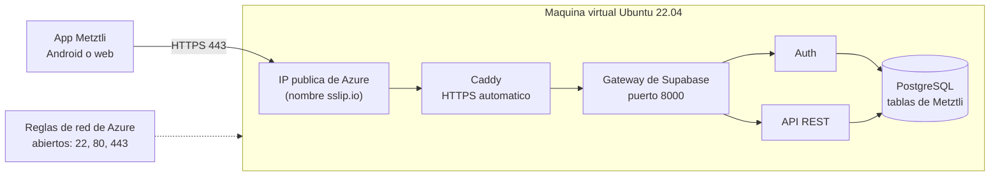

# Despliegue en Azure — Metztli

> **Entregables de Desarrollo (5)**: compilación, servidor en Azure con SSH, red y puertos, entorno y base de datos, y conexión de la app a la nube.
> **Qué se instala en Azure**: una máquina virtual Ubuntu con **Supabase completo** (base de datos PostgreSQL, autenticación y API), con las mismas tablas, roles y reglas de seguridad de Metztli.
> **Estado**: scripts y guía listos. **No se han podido ejecutar contra Azure** porque requieren una cuenta de Azure; la primera ejecución real es la de quien siga esta guía. Los scripts tienen la sintaxis revisada.

---

## 1. Cómo queda armado



La app no cambia de código: lee la dirección del servidor de dos variables (`EXPO_PUBLIC_SUPABASE_URL` y `EXPO_PUBLIC_SUPABASE_ANON_KEY`). Solo hay que apuntarlas al servidor de Azure.

---

## 2. Los 5 entregables y su evidencia

| # | Entregable | Cómo se cumple | Evidencia (captura de pantalla) |
| :-: | :--- | :--- | :--- |
| **1** | **Compilación de la aplicación** | APK Android publicado en [Releases](https://github.com/cuoconatwatah-create/Metztli/releases) y *build* web empaquetado (sección 6). | Página de Releases con `Metztli-x.y.z.apk` y el archivo `metztli-web.zip`. |
| **2** | **Configuración del servidor** | VM Ubuntu 22.04 en Azure, acceso remoto por SSH (sección 4). | La terminal conectada por SSH y el bloque *Entregable 2* de `3-evidencias.sh`. |
| **3** | **Red y puertos** | IP pública de Azure y reglas de red que abren 22 (SSH), 80 y 443 (sección 4). | Salida de `1-crear-vm.sh` con la IP y la tabla de reglas, y el bloque *Entregable 3*. |
| **4** | **Entorno y base de datos** | Node.js, Python, Docker y PostgreSQL (dentro de Supabase) funcionando en la VM (sección 5). | Bloque *Entregable 4*: versiones, contenedores en marcha y lista de tablas. |
| **5** | **Conexión a la nube** | La app usa `https://<IP>.sslip.io` en lugar de `localhost` (sección 7). | Bloque *Entregable 5* y la app guardando un registro que aparece en las tablas de la VM. |

---

## 3. Antes de empezar: la cuenta de Azure

Esto lo tienes que hacer tú: implica tus datos personales y, según el tipo de cuenta, una tarjeta.

1. **Si estudias**, usa [Azure para estudiantes](https://azure.microsoft.com/free/students): se verifica con el correo de tu institución, da crédito gratis y normalmente **no pide tarjeta**.
2. Si no, la [cuenta gratuita de Azure](https://azure.microsoft.com/free) da un crédito inicial por 30 días y pide tarjeta para verificar tu identidad.
3. Los montos y condiciones cambian: revísalos en la página al registrarte.

**Costo de la VM**: la `Standard_B2s` (2 CPU y 4 GB) cuesta alrededor de 30 USD al mes si queda encendida todo el tiempo. Para presentar basta tenerla encendida unos días. **Apágala al terminar**: `az vm deallocate -g metztli-rg -n metztli-vm`.

---

## 4. Crear la VM, abrir puertos y entrar por SSH (entregables 2 y 3)

1. Abre **[Azure Cloud Shell](https://shell.azure.com)** y elige **Bash**. Ya trae el comando `az`, sin instalar nada.
2. Descarga y ejecuta el primer script:

```bash
curl -fsSLO https://raw.githubusercontent.com/cuoconatwatah-create/Metztli/main/infra/azure/1-crear-vm.sh
bash 1-crear-vm.sh
```

3. Al terminar muestra la **IP pública**, el usuario y la tabla de reglas de red (puertos 22, 80 y 443). Guarda esa captura: es la evidencia del entregable 3.
4. Entra al servidor por SSH, desde el mismo Cloud Shell:

```bash
ssh azureuser@IP_PUBLICA
```

> Para limitar SSH a tu computadora usa `MY_IP=tu.ip.publica bash 1-crear-vm.sh`.

---

## 5. Instalar el servidor (entregable 4)

Ya dentro de la VM:

```bash
curl -fsSL https://raw.githubusercontent.com/cuoconatwatah-create/Metztli/main/infra/azure/2-instalar-servidor.sh | bash
```

Tarda entre 10 y 20 minutos, sobre todo por descargar las imágenes. Hace esto:

1. Prepara el sistema: memoria *swap* de 2 GB, Docker, Node.js 20 y Python 3.
2. Descarga Supabase para servidor propio y **genera claves y contraseñas nuevas**, solo para este servidor.
3. Publica la API por HTTPS en `https://<IP>.sslip.io`, con certificado automático (Caddy).
4. Crea las tablas, roles y reglas de seguridad de Metztli (`backend/supabase/setup_completo.sql`).
5. Guarda todo en `/opt/metztli-supabase/CREDENCIALES.txt`.

Al final imprime las dos líneas que necesita la app. Es seguro ejecutarlo otra vez: no regenera claves ni repite las tablas.

**Evidencias del servidor** (hace las capturas de los entregables 2, 3, 4 y 5):

```bash
bash /opt/metztli-src/infra/azure/3-evidencias.sh
```

---

## 6. Compilación de la aplicación (entregable 1)

| Pieza | Cómo se obtiene |
| :--- | :--- |
| **APK Android** | Se compila sola en GitHub al crear una etiqueta (`git tag v2.0.9 && git push origin v2.0.9`). Queda en [Releases](https://github.com/cuoconatwatah-create/Metztli/releases) para descargar desde el teléfono. |
| **Web (código empaquetado)** | `cd frontend && npx expo export -p web` genera la carpeta `dist/`. Para entregarla comprimida: `cd dist && zip -r ../metztli-web.zip .`. La web publicada está en `https://cuoconatwatah-create.github.io/Metztli/`. |

---

## 7. Conectar la app a Azure (entregable 5)

1. En el servidor, abre `/opt/metztli-supabase/CREDENCIALES.txt` y copia las dos líneas `EXPO_PUBLIC_SUPABASE_URL` y `EXPO_PUBLIC_SUPABASE_ANON_KEY`.
2. **Probar desde tu computadora**, sin tocar nada del proyecto:

```bash
EXPO_PUBLIC_SUPABASE_URL=https://IP-CON-GUIONES.sslip.io \
EXPO_PUBLIC_SUPABASE_ANON_KEY=la_clave_anonima \
node scripts/check-supabase.mjs
```

   Debe terminar en **"Todo en orden"**: comprueba la conexión, las 15 tablas, la seguridad y los datos de arranque.
3. **App local**: pega las dos líneas en `frontend/.env`.
4. **APK y web publicadas**: en GitHub, *Settings → Secrets and variables → Actions → Variables*, cambia `EXPO_PUBLIC_SUPABASE_URL` y `EXPO_PUBLIC_SUPABASE_ANON_KEY` por los nuevos valores, y crea una etiqueta nueva para compilar el APK.
5. **Demostrar que ya no es `localhost`**: crea una cuenta en la app, registra un día y activa **Perfil → Respaldar mis datos en la nube**. Luego, en la VM, muestra la fila:

```bash
sudo docker exec supabase-db psql -U supabase_admin -d postgres -c "select log_date, mood, sleep_hours from public.daily_logs"
```

> **Importante**: el servidor de Azure empieza con una base **vacía**. Las cuentas y los datos que hoy están en Supabase en la nube no se copian solos: hay que registrarse otra vez.

---

## 8. Seguridad y límites

- **Correo de confirmación apagado**: el script deja `ENABLE_EMAIL_AUTOCONFIRM=true` para no depender de un servidor de correo. Cualquier persona puede crear una cuenta con un correo que no es suyo. Para producción, configura SMTP y ponlo en `false` en `/opt/metztli-supabase/.env`, y reinicia con `sudo docker compose up -d`.
- **Claves nuevas**: el servidor propio usa sus propias claves, distintas a las de Supabase en la nube. `CREDENCIALES.txt` tiene secretas (`POSTGRES_PASSWORD`, `JWT_SECRET`, `SERVICE_ROLE_KEY`): **no las subas a GitHub** ni las compartas. Solo la `ANON_KEY` va en la app.
- **Puertos**: solo se abren 22, 80 y 443. El gateway de Supabase (8000) y la base de datos (5432) quedan cerrados desde internet. Limita el 22 a tu IP con `MY_IP`.
- **Panel de administración (Studio)**: está en la misma dirección, protegido con usuario y contraseña (están en `CREDENCIALES.txt`).
- **HTTPS con `sslip.io`**: es un servicio gratuito de terceros que apunta un nombre a tu IP. Sus certificados comparten un límite de emisión; si falla, usa tu propio dominio con `PUBLIC_HOST=tu-dominio.com`. Si cambia la IP de la VM (por ejemplo, al apagarla y encenderla), cambia el nombre: lo más simple es reservar la IP como *estática* en Azure.
- **Copias de seguridad**: la VM no hace copias automáticas. Para la presentación no hace falta.
- **Sin probar en Azure**: estos scripts no se han ejecutado contra una cuenta real. Si un paso falla, el mensaje de error dice cuál; la causa más probable es la memoria (usa una VM de al menos 4 GB) o la descarga de imágenes.
