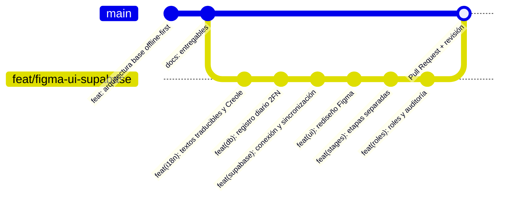
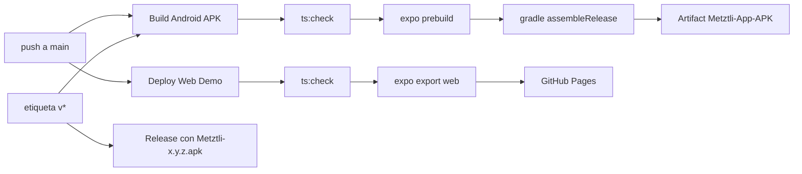

# Control de Versiones y CI/CD — Metztli

> **Entregable 4**: Control de versiones  
> **Proyecto**: Metztli — Plataforma de Salud Femenina Integral Offline-First  
> **Repositorio**: [github.com/cuoconatwatah-create/Metztli](https://github.com/cuoconatwatah-create/Metztli)  
> **Estado**: Historial legible, ramas por funcionalidad y pipelines automáticos  

---

## 1. Flujo de trabajo (GitHub Flow)



1. **`main`**: rama estable. Cada cambio que entra dispara el APK y la web demo.
2. **`feat/*`**: una rama por funcionalidad (aquí `feat/figma-ui-supabase`).
3. **`fix/*`**: correcciones puntuales.
4. Todo cambio entra por **Pull Request**.

### Comandos usados (evidencia)

| Comando | Para qué |
| :--- | :--- |
| `git switch -c feat/figma-ui-supabase` | Crear la rama de trabajo |
| `git add <archivos>` + `git commit -m "feat(...): ..."` | **Commit**: guardar cambios por tema, con mensaje legible |
| `git push -u origin feat/figma-ui-supabase` | **Push**: subir la rama a GitHub |
| `git pull origin main` | **Pull**: traer los cambios de `main` antes de fusionar y después del merge |
| `git log --oneline` | Revisar el historial |
| `git tag v2.0.10 && git push origin v2.0.10` | Crear una versión y publicar su Release con el APK |

---

## 2. Convención de commits (Conventional Commits)

`<tipo>(<ámbito>): <descripción>` — los mensajes largos explican el *qué* y el *porqué* en viñetas.

| Tipo | Uso |
| :--- | :--- |
| `feat` | Funcionalidad nueva visible para la usuaria |
| `fix` | Corrección de un error |
| `docs` | Documentación |
| `chore` | Mantenimiento y configuración |
| `refactor` | Reestructuración sin cambiar el comportamiento |

### Historial real del proyecto
```text
d1b8a6f feat(roles): Administradora, Usuaria y Auditora con bitácora, despliegue y documentación
481dd02 feat(stages): etapas separadas con cambio de etapa, modelo de embarazo y audios en Mískitu
9b95a93 feat(ui): rediseño según el prototipo de Figma
4b5a4e0 feat(supabase): conexión real, sincronización del foro y respaldo opcional
f1edafa feat(db): registro diario normalizado a 2FN con migración automática v1→v2
cbf009f feat(i18n): textos de interfaz traducibles, Creole y persistencia del idioma
9726a25 docs: actualizar y sincronizar todos los entregables y enlaces
ca7f477 feat: entrega de módulos de desarrollo y módulo de embarazo NBU con triage
```

---

## 3. CI/CD con GitHub Actions



| Workflow | Archivo | Cuándo corre | Resultado |
| :--- | :--- | :--- | :--- |
| **Build Android APK** | [`build-apk.yml`](../.github/workflows/build-apk.yml) | push a `main`, etiquetas `v*`, manual | APK como *artifact*; en etiquetas, también un **Release** descargable |
| **Deploy Web Demo** | [`deploy-web.yml`](../.github/workflows/deploy-web.yml) | push a `main`, manual | Sitio estático en GitHub Pages |

- Ambos verifican **TypeScript** (`npm run ts:check`) antes de construir.
- Reciben `EXPO_PUBLIC_SUPABASE_URL` y `EXPO_PUBLIC_SUPABASE_ANON_KEY` como **variables** del repositorio (claves públicas); sin ellas, construyen igual pero sin conexión a la nube.
- Guía paso a paso en [Despliegue y Presentación](DESPLIEGUE_Y_PRESENTACION.md).

### Pruebas automáticas (sin CI, ejecutables localmente)
- `cd backend && npm run test:rls`: migraciones + roles y RLS sobre PostgreSQL real en memoria.
- `cd frontend && npm run test:db`: base local SQLite (registro diario y embarazo, con sus migraciones).

---

## 4. Versionado semántico (SemVer)

El **código de versión de Android** se calcula solo a partir de la versión (`MAJOR×10000 + MINOR×100 + PATCH`, por ejemplo 2.0.10 → 20010) en `frontend/app.config.js`, para que cada compilación se instale como actualización de la anterior.

`MAJOR.MINOR.PATCH` — versión actual **2.0.10**, sincronizada en `frontend/package.json` y `frontend/app.json`.

- **MAJOR (2)**: arquitectura offline-first trilingüe.
- **MINOR (0)**: módulos de etapas, Desmitificador, Tribu y acompañante.
- **PATCH (1)**: ajustes y correcciones.

Las versiones se publican con etiquetas `vX.Y.Z` (Release + APK).
