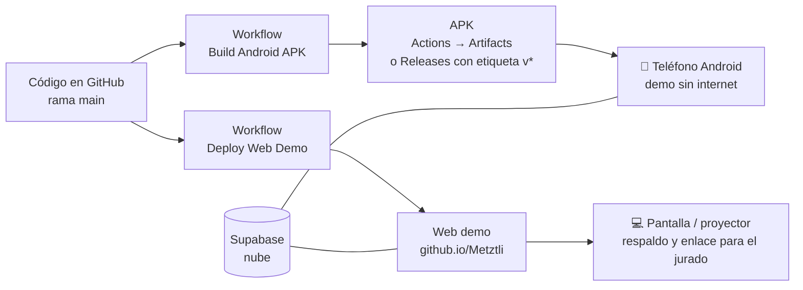

# Despliegue, Ejecución y Demostración — Metztli

> **Entregable 6**: Ejecución y demostración  
> **Proyecto**: Metztli — Salud Femenina Integral Offline-First  
> **Estado**: Pipelines listos · guion del video incluido  

El sistema debe ejecutarse **localmente sin errores** y acompañarse de un **video de navegación** como respaldo. Este documento reúne cómo ejecutar, dónde desplegar para una presentación y el guion para grabar el video.

---

## 1. ¿Dónde desplegar para presentar?



| Opción | Costo | Mejor para | Requisitos |
| :--- | :---: | :--- | :--- |
| **A. APK en un teléfono Android** ⭐ | Gratis | **Lo principal**: muestra el modo sin internet (modo avión) | APK de GitHub Actions o Releases |
| **B. Web demo en GitHub Pages** ⭐ | Gratis | Proyectar, compartir el enlace y respaldo si falla el teléfono | Activar Pages una vez (sección 2) |
| C. Expo Go con QR | Gratis | Ensayos rápidos con cambios en vivo | Teléfono y PC en la misma red |
| D. EAS Build (nube de Expo) | Gratis con límites | Build alternativo si falla GitHub Actions | Cuenta de Expo |

**Recomendación:** presentar con **A** (teléfono real, mostrando modo avión) y tener **B** abierta en el navegador como respaldo. La web usa un SQLite simulado (no persiste datos al recargar); el APK usa SQLite real.

---

## 2. Puesta en marcha en GitHub (una sola vez)

1. **Variables de Supabase** — repositorio → *Settings → Secrets and variables → Actions → pestaña **Variables** → New repository variable*:
   - `EXPO_PUBLIC_SUPABASE_URL` = `https://<tu-proyecto>.supabase.co`
   - `EXPO_PUBLIC_SUPABASE_ANON_KEY` = `sb_publishable_…` (clave **pública**; nunca la `service_role`)
   
   Sin estas variables el APK y la web se construyen, pero quedan sin conexión a la nube.
2. **GitHub Pages** — *Settings → Pages → Build and deployment → Source: **GitHub Actions***.
3. **Subir el código** (ver [Control de Versiones](CONTROL_DE_VERSIONES.md)): al fusionar a `main` se ejecutan los dos workflows.
4. **Resultados**
   - Web: `https://cuoconatwatah-create.github.io/Metztli/` (aparece en el job *deploy*).
   - APK: pestaña **Actions → Build Android APK → Artifacts → `Metztli-App-APK`**.
5. **APK con enlace fijo**: crea una etiqueta y súbela.
   ```bash
   git tag v2.0.6
   git push origin v2.0.6
   ```
   El workflow publica un **Release** con `Metztli-2.0.6.apk` para descargarlo desde el teléfono.

> El APK de CI se firma con la clave de depuración que genera `expo prebuild`. Es instalable para demostración; para publicarlo en Google Play habría que firmarlo con una clave propia.

---

## 3. Ejecución local (sin errores)

```bash
cd frontend
npm install
cp .env.example .env          # completa la URL y la publishable key de Supabase
npm run ts:check              # TypeScript: debe terminar sin errores
npm run web                   # http://localhost:8081
node ../scripts/check-supabase.mjs   # conexión, tablas, RLS y roles: "Todo en orden"
```

Si Metro falla por caché: `npx expo start -c`. Si cambias `metro.config.js`, reinicia el servidor.

---

## 4. Cuentas para la demostración (3 roles)

Para mostrar los tres roles se necesitan tres cuentas reales (el proyecto exige confirmar el correo):

1. En la app: **COMENZAR → Crear perfil** con tres correos (usuario, administrador, auditor). Confirma cada correo.
2. Asigna roles ejecutando [`backend/supabase/seed_roles_demo.sql`](../backend/supabase/seed_roles_demo.sql) en el SQL Editor (con tus correos).
3. Entra con cada cuenta (**Iniciar sesión**) y abre **Perfil**:
   - *Usuario*: sin paneles.
   - *Administrador*: **Panel de administración** (cuentas y roles, foro, mitos) y **Panel de auditoría**.
   - *Auditor*: **Panel de auditoría** (solo lectura).

---

## 5. Guion del video de navegación (≈ 5 minutos)

Graba la pantalla del teléfono (o de la web) con la voz explicando. Datos de prueba preparados de antemano: una cuenta por rol y un embarazo de ~20 semanas.

| Min | Qué mostrar | Qué decir |
| :-: | :--- | :--- |
| 0:00 | **Bienvenida** → cambiar idioma a Miskitu y volver a Español | "Metztli: salud femenina para la Costa Caribe, en tres idiomas." |
| 0:30 | **Crear perfil** (formulario con validación) → **elegir etapa** → código de acompañante | "Registro con privacidad: los datos son suyos." |
| 1:00 | **Menstruación**: anillo del ciclo, color del flujo, **+ Registrar mi día** → "Traducir mi día" | "El cuerpo habla; la app lo traduce en un consejo." |
| 1:45 | **Selector de etapa → Embarazo**: fecha → semana y progreso → **Controles** (agendar uno, marcar hecho) → **pataditas** | "Cada etapa tiene sus propias pantallas." |
| 2:45 | **Señales de alarma / Triage** y botón de auxilio por SMS | "Pensado para zonas sin cobertura." |
| 3:15 | **Aprendizaje → Desmitificador** → mito nuevo → **escuchar en Miskitu** (mito y verdad) | "Audios grabados por la comunidad." |
| 3:45 | **Modo avión**: registrar algo y publicar en el foro; quitar el modo avión y mostrar la sincronización | "Funciona sin internet y sincroniza después." |
| 4:15 | **Roles**: cerrar sesión → entrar como **Administrador** (cambiar un rol, borrar una publicación) → **Auditor** (bitácora con esas acciones) | "Tres roles aplicados en la base de datos; ni el administrador ve datos de salud." |
| 4:50 | Repositorio en GitHub: commits, Actions en verde | "Todo versionado y desplegado automáticamente." |

**Lista de verificación antes de grabar**
- [ ] `npm run ts:check` y `node scripts/check-supabase.mjs` sin errores.
- [ ] Batería, modo no molestar y notificaciones silenciadas; brillo alto.
- [ ] Tres cuentas con sus roles y una publicación de prueba en el foro.
- [ ] APK instalado y probado en el teléfono real; web demo abierta como respaldo.
- [ ] Wi-Fi disponible para el minuto 3:45 (se apaga y se vuelve a encender en cámara).

---

## 6. Problemas frecuentes

| Síntoma | Causa | Solución |
| :--- | :--- | :--- |
| Metro devuelve 500 al empaquetar audios | Servidor iniciado antes de cambiar `metro.config.js` | Reiniciar con `npx expo start -c` |
| APK/Web sin conexión a la nube | Faltan las variables `EXPO_PUBLIC_SUPABASE_*` en GitHub | Crearlas (sección 2) y volver a ejecutar el workflow |
| La web en Pages se ve en blanco | Pages no está en modo *GitHub Actions* | *Settings → Pages → Source: GitHub Actions* |
| Los audios en Miskitu no suenan en iPhone | iOS no reproduce Ogg/Opus | En iPhone se usa la voz sintética; convertir a `.m4a` si se necesita |
| No llega el correo de confirmación | Límite de correos del plan gratuito de Supabase | Esperar o confirmar el usuario desde *Authentication → Users* |
