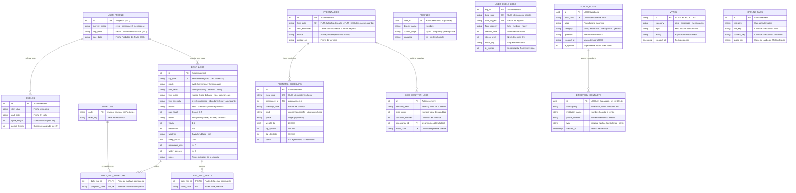

# Diagrama de Base de Datos y Modelo de Datos — Metztli

> **Entregable de Desarrollo**: Diagrama de base de datos  
> **Proyecto**: Metztli — Plataforma de Salud Femenina Integral Offline-First  
> **Fecha**: Septiembre 2026  
> **Estado**: Modelado, Implementado y Documentado  

---

## 1. Arquitectura de Datos Híbrida (Offline-First)

Metztli implementa una arquitectura de persistencia dual:
1. **Base de Datos Local Embebida (SQLite — `metztli.db`)**:
   - Reside en el almacenamiento privado del dispositivo mediante `expo-sqlite`.
   - Garantiza velocidad instantánea, cero latencia y disponibilidad 100% desconectada (*offline*).
   - Es el repositorio exclusivo de información íntima (ciclos menstruales, síntomas diarios, pataditas fetales).
2. **Base de Datos en la Nube (Supabase — PostgreSQL 15)**:
   - Aloja datos compartidos comunitariamente (Directorio de Emergencias, Mitos Médicos validados y Foro Anónimo).
   - Administrada con políticas estrictas de **Row Level Security (RLS)**.

---

## 2. Diagrama Entidad-Relación (ER) General


```mermaid
erDiagram
    %% ENTIDADES LOCALES (SQLite)
    USER_PROFILE {
        int id PK "Singleton (id=1)"
        string current_mode "cycle | pregnancy | menopause"
        string lmp_date "Fecha Ultima Menstruacion (ISO)"
        string due_date "Fecha Probable de Parto (ISO)"
    }

    CYCLES {
        int id PK "Autoincrement"
        string start_date "Fecha inicio ciclo"
        string end_date "Fecha fin ciclo"
        int cycle_length "Duracion ciclo (def: 28)"
        int period_length "Duracion sangrado (def: 5)"
    }

    DAILY_LOGS {
        int id PK "Autoincrement"
        string log_date UK "Fecha del registro (YYYY-MM-DD)"
        string mode "cycle | pregnancy | menopause"
        string flow_level "none | spotting | medium | heavy"
        string flow_color "rosado | rojo_brillante | rojo_oscuro | cafe"
        string flow_intensity "leve | moderado | abundante | muy_abundante"
        string mucus "seca | cremosa | acuosa | elastica"
        int pain_level "Escala 0-5"
        string mood "feliz | bien | triste | irritada | cansada"
        int vitality "1-5"
        int discomfort "1-5"
        string weather "lluvia | nublado | sol"
        real sleep_hours "0-24"
        int movement_min ">= 0"
        int water_glasses ">= 0"
        string notes "Notas privadas de la usuaria"
    }

    SYMPTOMS {
        string code PK "cramps, nausea, hotFlashes..."
        string label_key "Clave de traduccion"
    }

    DAILY_LOG_SYMPTOMS {
        int daily_log_id PK,FK "Parte de la clave compuesta"
        string symptom_code PK,FK "Parte de la clave compuesta"
    }

    DAILY_LOG_HABITS {
        int daily_log_id PK,FK "Parte de la clave compuesta"
        string habit_code PK "water, walk, breathe"
    }

    PREGNANCIES {
        int id PK "Autoincrement"
        string lmp_date UK "FUM (la fecha de parto = FUM + 280 dias, no se guarda)"
        int lmp_estimated "1 si se calculo desde la fecha de parto"
        string status "active | ended (solo uno activo)"
        string ended_on "Fecha de termino"
    }

    PRENATAL_CHECKUPS {
        int id PK "Autoincrement"
        string local_uuid UK "UUID idempotente cliente"
        int pregnancy_id FK "pregnancies.id"
        string checkup_date "Fecha del control"
        string kind "control | ecografia | laboratorio | otro"
        string place "Lugar (opcional)"
        real weight_kg "20-300"
        int bp_systolic "50-260"
        int bp_diastolic "30-160"
        int done "0 = agendado, 1 = realizado"
    }

    PROFILES {
        uuid user_id PK "auth.users (solo Supabase)"
        string display_name "Nombre"
        string current_stage "cycle | pregnancy | menopause"
        string language "es | miskitu | creole"
    }

    KICK_COUNTER_LOGS {
        int id PK "Autoincrement"
        string session_date "Fecha y hora de la sesion"
        int kick_count "Numero total de pataditas"
        int duration_minutes "Duracion en minutos"
        int pregnancy_id FK "pregnancies.id (nullable)"
        string local_uuid UK "UUID idempotente cliente"
    }

    USER_CYCLE_LOGS {
        int log_id PK "Autoincrement"
        string local_uuid UK "UUID idempotente cliente"
        string date_logged UK "Fecha de registro"
        string flow_intensity "light | medium | heavy"
        int cramps_level "Nivel de colicos 0-5"
        int stress_level "Nivel de estres 0-5"
        string mood_tag "Etiqueta emocional"
        int is_synced "0=pendiente, 1=sincronizado"
    }

    %% ENTIDADES SINCRONIZADAS (SQLite <-> Supabase)
    DIRECTORY_CONTACTS {
        uuid id PK "UUID en Supabase / int en SQLite"
        string municipality "Bluefields, Bilwi, Waspam, etc."
        string institution_name "Nombre hospital o centro"
        string phone_number "Numero telefonico directo"
        string type "hospital | police | ambulance | clinic"
        timestamp created_at "Fecha de creacion"
    }

    FORUM_POSTS {
        uuid id PK "UUID Supabase"
        string local_uuid UK "UUID idempotente local"
        string alias "Pseudonimo anonimo"
        string category "ciclo | embarazo | menopausia | general"
        string question "Texto de la consulta"
        string created_at "Marca temporal ISO"
        int is_synced "0=pendiente local, 1=en nube"
    }

    MYTHS {
        string id PK "c1..c4, e1..e4, m1..m3"
        string category "ciclo | embarazo | menopausia"
        string myth "Mito popular comunitario"
        string reality "Explicacion medica real"
        timestamp created_at "Fecha creacion"
    }

    OFFLINE_FAQS {
        int id PK "Autoincrement"
        string category "Categoria tematica"
        string title_key "Clave de traduccion titulo"
        string content_key "Clave de traduccion contenido"
        string audio_key "Clave de audio en Miskitu/Creole"
    }

    %% RELACIONES CONCEPTUALES
    USER_PROFILE ||--o{ DAILY_LOGS : "registra_en_etapa"
    DAILY_LOGS ||--o{ DAILY_LOG_SYMPTOMS : "incluye"
    SYMPTOMS ||--o{ DAILY_LOG_SYMPTOMS : "se_registra_en"
    DAILY_LOGS ||--o{ DAILY_LOG_HABITS : "cumple"
    PREGNANCIES ||--o{ KICK_COUNTER_LOGS : "registra_pataditas"
    PREGNANCIES ||--o{ PRENATAL_CHECKUPS : "tiene_controles"
    USER_PROFILE ||--o{ CYCLES : "calcula_con"
    FORUM_POSTS ||--o{ DIRECTORY_CONTACTS : "apoyo_comunitario"
```

---

## 3. Diccionario de Datos Exhaustivo

### 3.1 `user_profile` (Tabla Local de Estado)
Almacena la configuración activa de la usuaria en el dispositivo móvil. Contiene un único registro (patrón *Singleton* `id = 1`).

| Campo | Tipo SQLite | Restricciones | Descripción |
| :--- | :--- | :--- | :--- |
| `id` | `INTEGER` | `PRIMARY KEY CHECK (id = 1)` | Identificador único singleton. |
| `current_mode` | `TEXT` | `DEFAULT 'cycle'` | Modo actual: `'cycle'`, `'pregnancy'` o `'menopause'`. |
| `lmp_date` | `TEXT` | Nullable | Fecha de Última Menstruación en formato ISO (YYYY-MM-DD). |
| `due_date` | `TEXT` | Nullable | Fecha Estimada de Parto calculada mediante la Regla de Naegele. |

---

### 3.2 `cycles` (Historial y Predicción de Ciclos)
Almacena los intervalos entre menstruaciones para alimentar el algoritmo de predicción de la **Brújula Lunar**.

| Campo | Tipo SQLite | Restricciones | Descripción |
| :--- | :--- | :--- | :--- |
| `id` | `INTEGER` | `PRIMARY KEY AUTOINCREMENT` | ID interno autoincremental. |
| `start_date` | `TEXT` | `NOT NULL` | Fecha de inicio del periodo menstrual (YYYY-MM-DD). |
| `end_date` | `TEXT` | Nullable | Fecha de finalización del sangrado (YYYY-MM-DD). |
| `cycle_length` | `INTEGER` | `DEFAULT 28` | Longitud típica del ciclo en días. |
| `period_length`| `INTEGER` | `DEFAULT 5` | Duración típica del sangrado en días. |

---

### 3.3 `daily_logs` (Registro Diario) y tablas hijas
Un renglón por fecha con los datos atómicos del día. Los datos multivaluados (síntomas y hábitos) viven en tablas hijas, no en columnas JSON.

| Campo | Tipo SQLite | Restricciones | Descripción |
| :--- | :--- | :--- | :--- |
| `id` | `INTEGER` | `PRIMARY KEY AUTOINCREMENT` | ID autoincremental (no cambia al actualizar el día). |
| `log_date` | `TEXT` | `UNIQUE NOT NULL` | Fecha local del registro (un único registro por día). |
| `mode` | `TEXT` | `CHECK IN ('cycle','pregnancy','menopause')` | Etapa activa al registrar. |
| `flow_level` | `TEXT` | `CHECK IN ('none','spotting','medium','heavy')` | Nivel de flujo (modelo clínico). |
| `flow_color`, `flow_intensity`, `mucus` | `TEXT` | Nullable | Color, intensidad y mucosidad cervical de "Mi Ciclo". |
| `pain_level` | `INTEGER` | `CHECK BETWEEN 0 AND 5` | Dolor de cólicos. |
| `mood` | `TEXT` | Nullable | Ánimo del día. |
| `vitality`, `discomfort` | `INTEGER` | `CHECK BETWEEN 1 AND 5` | Escalas de "¿Cómo habitas tu día?". |
| `weather` | `TEXT` | Nullable | Clima emocional. |
| `sleep_hours` | `REAL` | `CHECK BETWEEN 0 AND 24` | Horas de sueño. |
| `movement_min` | `INTEGER` | `CHECK >= 0` | Minutos de movimiento. |
| `water_glasses` | `INTEGER` | `CHECK >= 0` | Vasos de agua. |
| `notes` | `TEXT` | Nullable | Texto libre privado. |

**`symptoms`** — catálogo: `code TEXT PRIMARY KEY`, `label_key TEXT NOT NULL`.

**`daily_log_symptoms`** — `PRIMARY KEY (daily_log_id, symptom_code)`; `daily_log_id` → `daily_logs(id) ON DELETE CASCADE`, `symptom_code` → `symptoms(code)`.

**`daily_log_habits`** — `PRIMARY KEY (daily_log_id, habit_code)`; `daily_log_id` → `daily_logs(id) ON DELETE CASCADE`.

#### Normalización aplicada (hasta 2FN)

| Antes (v1) | Problema | Ahora (v2) |
| :--- | :--- | :--- |
| `pregnancy_symptoms` (JSON) y `symptoms_json` (JSON) | Campos multivaluados: incumplen **1FN**, imposibles de consultar o validar | Filas en `daily_log_symptoms` con FK al catálogo `symptoms` |
| Hábitos serializados dentro de `notes` | Mezcla texto libre con datos estructurados | Filas en `daily_log_habits` |
| Sueño, agua, color del flujo… como etiquetas `clave:valor` dentro del JSON | Atributos sin tipo ni restricciones | Columnas tipadas con `CHECK` en `daily_logs` |
| `INSERT OR REPLACE` | Borraba y recreaba el renglón (cambiaba el `id`) | `INSERT … ON CONFLICT(log_date) DO UPDATE` (el `id` se conserva) |

**2FN:** todas las tablas tienen clave primaria. En las que la clave es simple (`daily_logs`, `cycles`, `symptoms`, …) no pueden existir dependencias parciales. Las dos tablas con clave compuesta (`daily_log_symptoms`, `daily_log_habits`) no guardan atributos adicionales, por lo que ningún atributo depende de solo una parte de la clave.

**Migración automática v1 → v2** (`frontend/src/db/schema.ts`, se ejecuta al abrir la app y es idempotente): renombra la tabla antigua, crea el esquema nuevo, reparte los JSON en columnas y filas hijas, descarta valores fuera de rango y elimina la tabla antigua. `PRAGMA user_version = 2`.

**Supabase:** `backend/supabase/migrations/20240101000002_daily_logs_normalized.sql` crea el mismo modelo (con `user_id`, `UNIQUE (user_id, log_date)` y RLS por dueña). Aún no está conectado; la clave natural `(user_id, log_date)` permitirá sincronizar sin `local_uuid`.

---

### 3.3b Etapas separadas: embarazo, controles y perfil (esquema v3)

Cada etapa (menstruación, embarazo, menopausia) tiene sus propias pantallas (`frontend/src/navigation/StageTabs.tsx`); la etapa activa se guarda en `user_profile.current_mode` (local) y en `profiles.current_stage` (nube, solo con respaldo activado).

| Tabla | Clave | Notas de normalización |
| :--- | :--- | :--- |
| `pregnancies` | `id` (autoincremental / uuid) | Un embarazo es una entidad propia. Antes `lmp_date` y `due_date` eran columnas sueltas de `user_profile` y nada las llenaba. Solo se guarda la FUM: la fecha probable de parto se **deriva** (FUM + 280 días), así no hay dependencia transitiva. Índice único parcial: un solo embarazo `active`. |
| `prenatal_checkups` | `id`; `local_uuid` único | FK a `pregnancies` (`ON DELETE CASCADE`). `CHECK` en peso (20–300 kg) y presión (sistólica 50–260, diastólica 30–160). `done` distingue cita agendada de realizada. |
| `kick_counter_logs` | `id` | Se agregan `pregnancy_id` (FK, `ON DELETE SET NULL`: las pataditas sobreviven si se borra el embarazo) y `local_uuid` para sincronizar. |
| `profiles` (solo Supabase) | `user_id` | 1:1 con `auth.users`; un trigger lo crea al registrarse. Guarda etapa activa e idioma. |
| `kick_sessions` (solo Supabase) | `id`; único `(pregnancy_id, local_uuid)` | Espejo de `kick_counter_logs`. |

**Migración v2 → v3** (`frontend/src/db/pregnancySchema.ts`, automática e idempotente): crea las tablas, agrega las columnas de pataditas, mueve las fechas del perfil a un embarazo activo (si solo había fecha de parto, calcula la FUM y marca `lmp_estimated`), liga las pataditas existentes y elimina las columnas viejas de `user_profile`. `PRAGMA user_version = 3`.

**Supabase:** `20240101000004_stages_pregnancy.sql` (con RLS por dueña; los controles y pataditas heredan el permiso del embarazo) y `20240101000005_myth_c5.sql` (nuevo mito).

---

### 3.4 `kick_counter_logs` (Contador de Pataditas Fetales)
Registra las sesiones de monitoreo de movimientos fetales para el seguimiento obstétrico.

| Campo | Tipo SQLite | Restricciones | Descripción |
| :--- | :--- | :--- | :--- |
| `id` | `INTEGER` | `PRIMARY KEY AUTOINCREMENT` | ID autoincremental. |
| `session_date`| `TEXT` | `NOT NULL` | Marca temporal de la sesión (ISO 8601). |
| `kick_count` | `INTEGER` | `NOT NULL` | Total de movimientos registrados en la sesión. |
| `duration_minutes` | `INTEGER` | `NOT NULL` | Duración total de la sesión en minutos. |

---

### 3.5 `user_cycle_logs` (Brújula Lunar y Registro Sincronizable)

| Campo | Tipo SQLite / Postgres | Restricciones | Descripción |
| :--- | :--- | :--- | :--- |
| `log_id` | `INTEGER / SERIAL` | `PRIMARY KEY` | ID numérico. |
| `local_uuid` | `TEXT` | `UNIQUE NOT NULL` | UUID generado por el cliente móvil para sincronización. |
| `date_logged` | `TEXT / DATE` | `NOT NULL` | Fecha del reporte de ciclo. |
| `flow_intensity` | `TEXT` | `CHECK IN ('light','medium','heavy')` | Intensidad del flujo. |
| `cramps_level` | `INTEGER` | `CHECK (0 <= cramps_level <= 5)` | Nivel de cólicos. |
| `stress_level` | `INTEGER` | `CHECK (0 <= stress_level <= 5)` | Nivel de estrés. |
| `mood_tag` | `TEXT` | Nullable | Etiqueta emocional. |
| `is_synced` | `INTEGER` | `DEFAULT 0` (solo SQLite) | Bandera local: `0` = pendiente, `1` = sincronizado. |
| `user_id` | `UUID` | Nullable (solo Supabase) | Llave foránea a `auth.users(id)` si se autentica. |

---

### 3.6 `forum_posts` (Tribu / Foro Comunitario Anónimo)

| Campo | Tipo SQLite / Postgres | Restricciones | Descripción |
| :--- | :--- | :--- | :--- |
| `id` | `INTEGER / UUID` | `PRIMARY KEY` | ID local autoincremental en SQLite / UUID en Supabase. |
| `local_uuid` | `TEXT` | `UNIQUE NOT NULL` | UUID único universal para sincronización idempotente. |
| `alias` | `TEXT` | `NOT NULL` | Seudónimo comunitario anónimo (ej. "Luna Creciente"). |
| `category` | `TEXT` | `NOT NULL` | `'ciclo'`, `'embarazo'`, `'menopausia'`, `'general'`. |
| `question` | `TEXT` | `NOT NULL` | Pregunta o inquietud planteada. |
| `created_at` | `TEXT / TIMESTAMPTZ` | `NOT NULL` | Fecha y hora de publicación. |
| `is_synced` | `INTEGER` | `DEFAULT 0` (solo SQLite) | Bandera de sincronización en cliente. |

---

### 3.7 `directory_contacts` (Directorio Médico de Emergencias)

| Campo | Tipo | Restricciones | Descripción |
| :--- | :--- | :--- | :--- |
| `id` | `INTEGER / UUID` | `PRIMARY KEY` | Identificador de contacto. |
| `municipality` | `TEXT` | `NOT NULL` | Municipio: `'Bluefields'`, `'Bilwi'`, `'Waspam'`, etc. |
| `institution_name` | `TEXT` | `NOT NULL` | Nombre institucional del centro hospitalario o policial. |
| `phone_number` | `TEXT` | `NOT NULL` | Número telefónico para marcado directo. |
| `type` | `TEXT` | `NOT NULL` | Tipo de entidad: `'hospital'`, `'police'`, `'clinic'`, `'brigade'`. |

---

### 3.8 `myths` (Desmitificador Intercultural)

| Campo | Tipo | Restricciones | Descripción |
| :--- | :--- | :--- | :--- |
| `id` | `TEXT` | `PRIMARY KEY` | Identificador alfanumérico (ej. `'c1'`, `'e1'`, `'m1'`). |
| `category` | `TEXT` | `CHECK IN ('ciclo', 'embarazo', 'menopausia')` | Etapa asociada. |
| `myth` | `TEXT` | `NOT NULL` | Creencia o tabú popular recopilado en comunidades. |
| `reality` | `TEXT` | `NOT NULL` | Respuesta científica, médica y comprensible. |

---

## 4. Estrategia de Sincronización y Resolución de Conflictos

El motor de sincronización (`frontend/src/db/sync.ts` y `useSyncQueue.ts`) opera bajo las siguientes reglas:

```
┌─────────────────┐      1. Usuario publica post offline      ┌──────────────────────┐
│  Dispositivo    ├──────────────────────────────────────────►│  SQLite Local        │
│  (Sin internet) │                                           │  is_synced = 0       │
└─────────────────┘                                           │  local_uuid = "abc"  │
                                                              └──────────┬───────────┘
                                                                         │
                         2. NetInfo detecta conexión                     │
                            Se invoca syncForumPosts()                   │
                                                                         ▼
┌─────────────────┐      3. INSERT a Supabase                 ┌──────────────────────┐
│  Supabase Cloud │◄──────────────────────────────────────────┤  Sync Engine         │
│  (PostgreSQL)   │                                           │  (frontend/src/db)   │
└────────┬────────┘                                           └──────────▲───────────┘
         │                                                               │
         └──────── 4. Supabase responde 201 Created (o 23505 Duplicate) ─┘
                      5. SQLite ejecuta: UPDATE is_synced = 1 WHERE local_uuid = "abc"
```

1. **Garantía Idempotente**: Si la conexión falla a mitad de la transmisión y el paquete llegó al servidor, el reintento enviará el mismo `local_uuid`. Supabase captura la violación de unicidad (`error.code === '23505'`) y el cliente marca con seguridad el registro como sincronizado sin duplicar contenido en el foro.
2. **Prioridad Local (Offline Authority)**: Los datos de salud privada nunca son sobreescritos por servidores externos; el cliente es la única fuente de la verdad para el historial menstrual y síntomas.
