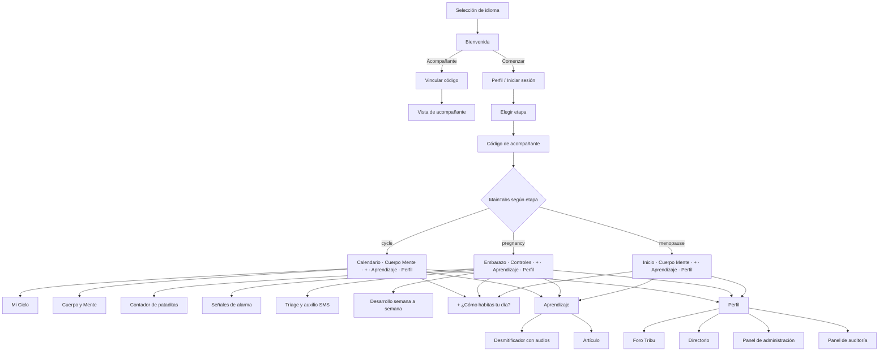

# Interfaz y Desarrollo — Metztli

> **Entregable 3**: Interfaces y desarrollo  
> **Proyecto**: Metztli — Plataforma de Salud Femenina Integral Offline-First  
> **Estado**: Interfaces totalmente navegables, con formularios funcionales  
> **Origen del diseño**: prototipo de Figma `prototipo_metztli` (onboarding, calendario, cuerpo y mente, aprendizaje, historial, acompañante)  

---

## 1. Filosofía de diseño

1. **Claridad y accesibilidad cognitiva**: poca carga de texto, iconografía simple, audio en los contenidos clave (lectura por voz y audios comunitarios en Miskitu) para usuarias con distintos niveles de alfabetización.
2. **Identidad cálida**: fondo avena, carmín como color de acción y verde bosque para lo educativo y de apoyo.
3. **Trilingüe real**: Español, Miskitu y Creole con cambio inmediato desde Perfil y Bienvenida; el idioma elegido se recuerda.
4. **Una etapa a la vez**: cada etapa de vida (menstruación, embarazo, menopausia) tiene sus propias pantallas, para no mezclar información que no corresponde.

---

## 2. Sistema de diseño (`frontend/src/theme/index.ts`)

### 2.1 Paleta
| Token | HEX | Uso |
| :--- | :---: | :--- |
| `avena` | `#F4F1EA` | Fondo de la app |
| `carmin` | `#8B2635` | Color primario: botones, encabezados, acciones y alertas |
| `bosque` | `#2C3D30` | Contenido educativo, acompañante y auditoría |
| `carbon` | `#1A1A1A` | Texto principal |
| `blush` | `#FDF2F4` | Fondos suaves de selección |
| `mauve` | `#7A6076` | Tarjetas de salud mental |
| `gold` | `#D9A93A` | Fase de ovulación |

### 2.2 Tipografía
- **Inter** (cargada con `@expo-google-fonts/inter`): Regular, Medium, SemiBold, Bold y ExtraBold.
- Títulos en `Inter ExtraBold` (el prototipo usa *Clash Display*; basta cambiar `fonts.display` cuando se incluya esa fuente).
- Escalas habituales: título de pantalla 24 px, sección 15–20 px, cuerpo 12–14 px, etiquetas 9–11 px.

### 2.3 Componentes base (`src/components/ui.tsx`)
`Button`, `Card`, `Chip`, `CurvedHeader`, `SegmentedTabs`, `Stepper`, `LevelBar`, `StepDots`, `BackLink`, `HubRow` y `SectionTitle`. Todos con etiquetas de accesibilidad.

---

## 3. Internacionalización

- `i18next` con dos espacios: **`translation`** (claves clásicas, trilingüe: `es.json`, `miskitu.json`, `creole.json`) y **`ui`** (el texto en español es la clave: `u('Tu ciclo')`).
- Si falta una traducción se muestra el español; nunca una clave rota.
- **Creole**: traducido por completo (interfaz y artículos). **Miskitu**: textos clásicos del equipo + audios comunitarios; la interfaz nueva queda en español hasta contar con revisión de hablantes nativos.
- La elección se guarda (`SecureStore` / `localStorage`) y se restaura al abrir la app.

---

## 4. Navegación por etapas

El selector de etapa (botón bajo el título de cada inicio, y en Perfil) cambia el conjunto de pestañas al instante (`navigation/StageTabs.tsx`, `context/StageContext.tsx`).

---

## 5. Catálogo de pantallas (`frontend/src/screens/`)

**Entrada y cuenta**
1. **`LanguageSelectionScreen`** y **`WelcomeScreen`**: idioma, logo vectorial, *Comenzar* / *Acompañante* / *Iniciar sesión*.
2. **`AuthScreen`**: formulario de perfil (nombre, correo electrónico, contraseña mínima de 8) con validación; modo inicio de sesión; aviso para confirmar el correo.
3. **`StageSelectionScreen`**: elegir etapa.
4. **`TribuCodeScreen`**: código de acompañante y compartir.

**Etapa Menstruación**
5. **`CycleHomeScreen`** (*Calendario*): anillo del ciclo con fases, color del flujo, moco cervical, "Escucha y previene" (con audio), modo retiro.
6. **`MiCicloScreen`**: registrar período (días, color, intensidad, mucosidad), fases y plantas.
7. **`CuerpoMenteScreen`**: ánimo, horas de sueño, movimiento, hidratación y ejercicios guiados por voz.

**Etapa Embarazo**
8. **`PregnancyHomeScreen`**: pide la FUM o fecha de parto (selector con botones), muestra semana, trimestre, progreso, tamaño del bebé y próximo control.
9. **`PrenatalScreen`** (*Controles*): agendar o registrar controles (fecha, tipo, lugar, peso, presión) con alerta si la presión es ≥ 140/90.
10. **`KickCounterScreen`**, **`ObstetricAlarmScreen`**, **`PregnancyTimelineScreen`** y **`PregnancyScreen`** (triage con auxilio por SMS).

**Etapa Menopausia**
11. **`MenopauseHomeScreen`**: registro de síntomas del día y accesos a contenido.

**Comunes**
12. **`ComoHabitasScreen`** (botón **+**): vitalidad, incomodidad, clima emocional y notas; el consejo y las alertas dependen de la etapa.
13. **`AprendizajeScreen`** y **`ArticleScreen`**: botiquín de saberes por etapa con lectura por voz.
14. **`DesmitificadorScreen`**: mitos y verdades; botones para **escuchar el mito y la verdad en Miskitu**.
15. **`PerfilScreen`**: etapa, rol, resumen e **historial** (índice de bienestar), respaldo opcional en la nube, idioma, cerrar sesión.
16. **`ForumScreen`** (Tribu anónima) y **`DirectoryScreen`** (emergencias por municipio).
17. **`PartnerDashboardScreen`** y **`PartnerMainScreen`**: vista del acompañante.

**Por rol**
18. **`AdminPanelScreen`** (Administradora): cuentas y roles, moderación del foro, gestión de mitos.
19. **`AuditPanelScreen`** (Auditora): estadísticas agregadas y bitácora de solo lectura. Detalle en [Seguridad y Roles](SEGURIDAD_Y_BUENAS_PRACTICAS.md).

### Formularios funcionales
Perfil (validación), registrar período, registrar día, ¿Cómo habitas tu día?, fecha del embarazo, nuevo control prenatal (con validación de rangos), publicación en el foro, historia anónima, agregar mito (administradora).

---

## 6. Componentes destacados

- **`CycleRing`**: anillo SVG con las cuatro fases y el día actual.
- **`StageSwitcher`**: botón + hoja inferior para cambiar de etapa.
- **`DateStepper`**: fecha con botones − / + (sin teclado ni librerías nativas, pensado para uso offline).
- **`MythAudioButtons`**: reproduce el mito y la verdad grabados en Miskitu (`expo-av`).
- **`Logo`**: emblema vectorizado a partir del logo oficial (nítido a cualquier tamaño).
