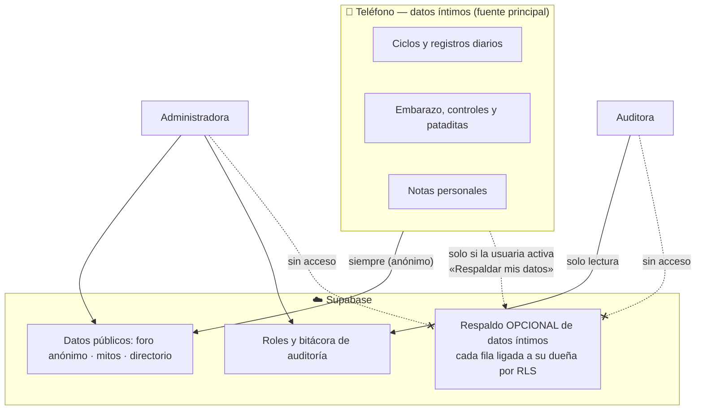
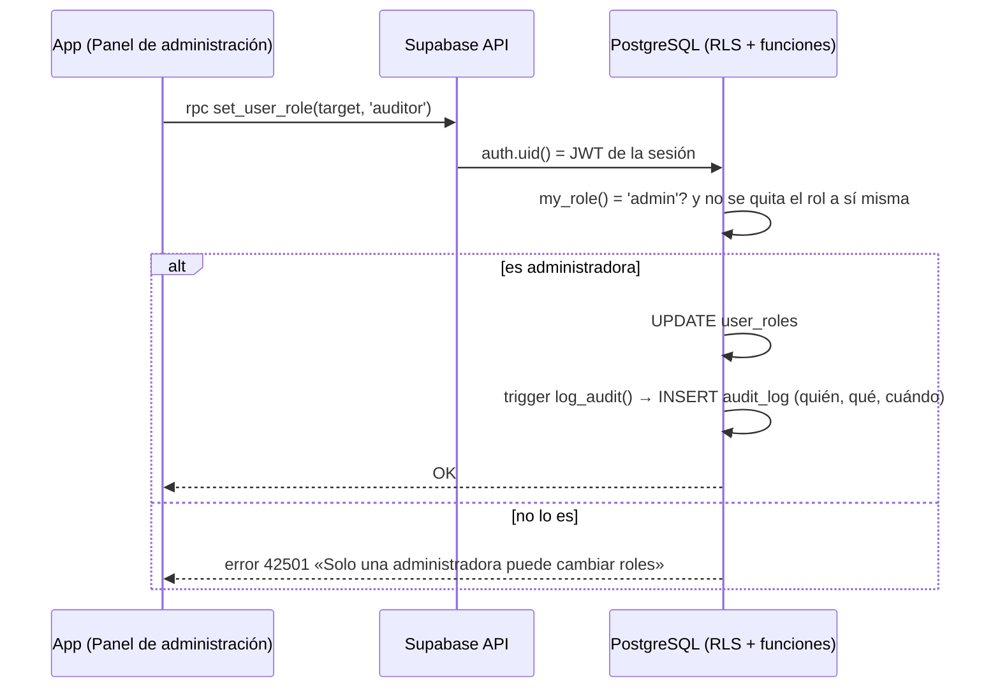

# Seguridad, Roles y Buenas Prácticas — Metztli

> **Entregable 5**: Seguridad y roles  
> **Proyecto**: Metztli — Plataforma de Salud Femenina Integral Offline-First para la Costa Caribe de Nicaragua  
> **Estado**: Implementado y verificado con pruebas automáticas sobre PostgreSQL real  

---

## 1. Filosofía de privacidad

Metztli maneja información muy sensible (ciclos, embarazo, síntomas) de mujeres que viven en comunidades pequeñas donde el estigma es real. Por eso aplica **Privacidad desde el Diseño y por Defecto**:



- Los datos íntimos **nacen y viven en SQLite**, en el teléfono.
- El respaldo en la nube es **opt-in** (interruptor en Perfil, apagado por defecto), se puede **borrar** desde la misma pantalla y exige tener sesión.
- **Ningún rol** (ni administradora ni auditora) puede leer datos de salud de otra persona.

---

## 2. Protección de datos de salud

### 2.1 En el dispositivo
- `daily_logs`, `cycles`, `pregnancies`, `prenatal_checkups` y `kick_counter_logs` se guardan solo en SQLite (`metztli.db`). Esquema normalizado a 2FN con restricciones `CHECK` (rangos de peso, presión, escalas) y claves foráneas activas.
- Si la usuaria desinstala la app, esos datos desaparecen del teléfono.

### 2.2 Sincronización e idempotencia
- Foro y mitos se sincronizan siempre; los envíos usan `local_uuid` y la restricción `UNIQUE` evita duplicados ante reintentos (código `23505` = "ya existía").
- El respaldo de salud usa claves naturales (`user_id + fecha`, `user_id + FUM`) para ser idempotente y **no pisa** datos locales al restaurar.
- La moderación se propaga: lo que la administradora borra en la nube sale también de los teléfonos al sincronizar.

---

## 3. Almacenamiento seguro en el dispositivo (`expo-secure-store`)

| Dato | Dónde se guarda |
| :--- | :--- |
| Sesión de Supabase (tokens) | `SecureStore` (Keystore/Keychain) mediante un adaptador en `src/lib/supabase.ts` |
| Alias anónimo del foro | `SecureStore` |
| Idioma, etapa activa, interruptor de respaldo, copia del rol (solo para pintar la interfaz sin conexión) | `SecureStore` (en web, `localStorage`) |

> La copia local del rol **no concede permisos**: cada acción se valida en la base de datos.

---

## 4. Anonimato en el foro comunitario

1. Alias automáticos (`Luna_Bluefields_12`): sin nombres, cédula ni teléfono.
2. **No se envía `user_id`** al publicar: el foro es anónimo incluso para quien tiene cuenta.
3. Sin IP, modelo de dispositivo ni ubicación en `forum_posts`.
4. Endurecido en la base: textos acotados, categorías válidas y nadie puede publicar a nombre de otra (`user_id` solo `NULL` o propio).

---

## 5. Roles y permisos (Administradora · Usuaria · Auditora)

Los roles viven en la tabla `user_roles` y se aplican **en la base de datos** (RLS + funciones `SECURITY DEFINER`), no solo en la interfaz. Código: [`20240101000006_roles_audit.sql`](../backend/supabase/migrations/20240101000006_roles_audit.sql).

### 5.1 Matriz de permisos

| Capacidad | Sin sesión | Usuaria | Administradora | Auditora |
| :--- | :---: | :---: | :---: | :---: |
| Leer foro, mitos y directorio | ✅ | ✅ | ✅ | ✅ |
| Publicar en el foro (anónimo) | ✅ | ✅ | ✅ | ✅ |
| Leer / escribir **sus propios** datos de salud | — | ✅ | ✅ | ✅ |
| Leer datos de salud **de otras personas** | ❌ | ❌ | ❌ | ❌ |
| Ver su propio rol | — | ✅ | ✅ | ✅ |
| Ver los roles de todas las cuentas | ❌ | ❌ | ✅ | ✅ |
| **Cambiar roles** (`set_user_role`) | ❌ | ❌ | ✅ | ❌ |
| Listar cuentas con correo enmascarado | ❌ | ❌ | ✅ | ❌ |
| **Moderar el foro** (borrar publicaciones) | ❌ | ❌ | ✅ | ❌ |
| **Gestionar mitos y directorio** | ❌ | ❌ | ✅ | ❌ |
| Ver la **bitácora** (`audit_log`) | ❌ | ❌ | ✅ | ✅ |
| Ver **estadísticas agregadas** (`audit_stats`) | ❌ | ❌ | ✅ | ✅ |
| Modificar o borrar la bitácora | ❌ | ❌ | ❌ | ❌ |

### 5.2 Cómo se hace cumplir



- **`my_role()`** devuelve `anon`, `user`, `admin` o `auditor` según la sesión; las políticas la usan.
- **Nadie escribe en `user_roles` ni `audit_log` directamente** (privilegios `INSERT/UPDATE/DELETE` revocados): solo `set_user_role()` y los *triggers*.
- **Primera administradora**: no puede nombrarse desde la app; la dueña del proyecto ejecuta [`seed_roles_demo.sql`](../backend/supabase/seed_roles_demo.sql) una vez.
- **Protecciones**: una administradora no puede quitarse a sí misma el rol; los roles válidos están limitados con `CHECK`; la bitácora tiene un *trigger* que rechaza `UPDATE` y `DELETE` incluso para la dueña del proyecto.
- **Auditoría**: se registran los cambios de rol, la moderación del foro y las altas/cambios/bajas de mitos y directorio, con `actor_id`, `actor_role`, acción, tabla y un resumen sin datos personales.
- **En la app**: `RoleContext` lee el rol; Perfil muestra "Tu rol" y los paneles que correspondan ([`AdminPanelScreen`](../frontend/src/screens/AdminPanelScreen.tsx), [`AuditPanelScreen`](../frontend/src/screens/AuditPanelScreen.tsx)). Si el rol no alcanza, la pantalla muestra "Acceso restringido" y, aunque se forzara, la base rechaza la acción.

### 5.3 Pruebas automáticas

`backend/tests/rls.test.mjs` aplica **todas las migraciones** sobre un PostgreSQL real en memoria (PGlite) y simula sesiones de cada rol:

```bash
cd backend
npm install
npm run test:rls
```

Comprueba, entre otros: que registrarse crea perfil y rol `user`; que una usuaria no cambia roles, no ve la bitácora ni modera; que la administradora cambia roles, modera y **no** lee datos íntimos; que la auditora ve bitácora y estadísticas pero **no puede** modificar; que sin sesión solo se lee y se publica en el foro; y que la bitácora es inmutable.

---

## 6. Políticas RLS por tabla

| Tabla | Lectura | Escritura |
| :--- | :--- | :--- |
| `directory_contacts` | Pública | Solo administradora |
| `myths` | Pública | Solo administradora |
| `forum_posts` | Pública | Insertar: cualquiera (con `user_id` nulo o propio); borrar: solo administradora |
| `symptoms` | Pública | Solo desde migraciones |
| `user_cycle_logs`, `cycles`, `daily_logs`, `pregnancies`, `profiles` | Solo la dueña (`auth.uid() = user_id`) | Solo la dueña |
| `daily_log_symptoms`, `daily_log_habits`, `prenatal_checkups`, `kick_sessions` | Solo la dueña del registro padre (`EXISTS` sobre la tabla padre) | Solo la dueña |
| `user_roles` | Cada quien su fila; administradora y auditora todas | Solo mediante `set_user_role()` |
| `audit_log` | Administradora y auditora | Solo *triggers* (inmutable) |

---

## 7. Mitigación de inyección SQL

En SQLite todas las consultas usan **parámetros** (`?`); el SQL dinámico solo compone nombres de columna tomados de listas blancas:

```typescript
// ✅ Implementado (src/db/schema.ts)
await db.runAsync(
  `INSERT INTO daily_logs (${COLUMNS.join(', ')}) VALUES (${COLUMNS.map(() => '?').join(', ')})
   ON CONFLICT(log_date) DO UPDATE SET ${updates}`,
  values
);
// ❌ Evitado: interpolar valores del usuario en el SQL
```

En Supabase, el cliente usa PostgREST (consultas parametrizadas) y las funciones validan sus argumentos (`new_role` solo admite tres valores).

---

## 8. Secretos y variables de entorno

1. En la app solo viaja la **clave pública** (`EXPO_PUBLIC_SUPABASE_ANON_KEY`, formato `sb_publishable_…`) y la URL. **Nunca** la `service_role`.
2. `.env` está en `.gitignore`; la plantilla es [`frontend/.env.example`](../frontend/.env.example).
3. En GitHub Actions las claves públicas van como **Variables** del repositorio (ver [Despliegue](DESPLIEGUE_Y_PRESENTACION.md)).
4. `scripts/check-supabase.mjs` comprueba contra el servidor real que un usuario anónimo no ve datos íntimos, no puede cambiar roles y no puede escribir contenido.

---

## 9. Resiliencia y manejo de errores

1. **Conectividad**: antes de sincronizar se consulta `NetInfo`; sin red la app sigue en modo local.
2. **Errores contextuales**: las excepciones de red o base se capturan sin congelar la interfaz; las acciones de los paneles muestran el mensaje exacto de la base si no se completan.
3. **Entorno web**: un SQLite simulado en memoria permite probar la interfaz sin romper la app.
4. **Auxilio de emergencia sin nube**: el triage del embarazo usa el esquema `sms:` hacia la partera o Casa Materna, con **minimización de datos** (solo semana y síntoma).
5. **Datos que no deben parecer médicos**: las alertas (presión ≥ 140/90, dolor intenso, señales de preeclampsia) orientan a acudir al centro de salud; la app no diagnostica.

---

## 10. Lista de verificación

- [x] **Privacy by Design**: datos de salud en local; respaldo opcional y borrable.
- [x] **3 roles funcionales** (Administradora, Usuaria, Auditora) aplicados con RLS y funciones en la base.
- [x] **Mínimo privilegio**: ningún rol lee datos de salud ajenos; la auditora es solo lectura.
- [x] **Bitácora de auditoría inmutable** de las acciones del personal.
- [x] **RLS activo en todas las tablas** y probado con sesiones simuladas de cada rol.
- [x] **Sesión en `SecureStore`**; sin secretos en el repositorio.
- [x] **Consultas parametrizadas** y validación de argumentos en funciones.
- [x] **Foro anónimo** sin `user_id` ni PII, endurecido en la base.
- [x] **Resiliencia de red** e idempotencia en la sincronización.
- [x] **Auxilio SMS** offline con minimización de datos.
